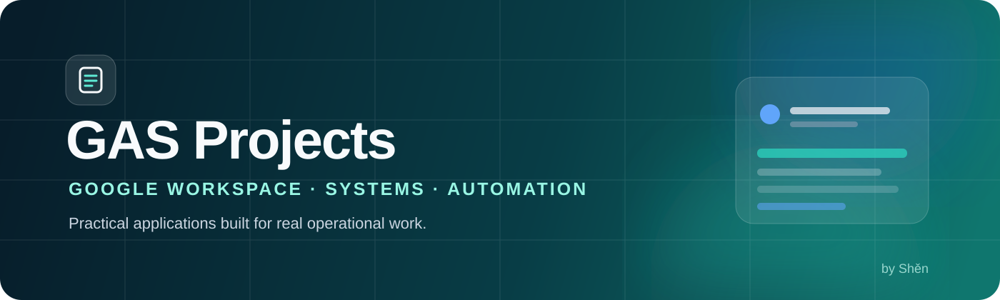

<p align="center">
  
</p>

<p align="center">
  
  
  
</p>

<p align="center">
  A curated collection of Google Workspace applications built to turn everyday operations<br>
  into clear, reliable, and maintainable digital workflows.
</p>

---

## Featured projects

| | Project | What it solves | Core capabilities |
| :---: | --- | --- | --- |
| 🏥 | **[MC Materials Chonburi](./MC%20Materials%20Chonburi/)** | Material, ink, and requisition management for a medical center | Admin/User portals · stock ledger · fiscal reports · Google Sheets database |
| ❤️ | **[BP Tracker](./BP_Tracker/)** | Blood-pressure recording and follow-up | Data entry · history · monitoring |
| 📊 | **[PWA Analytics](./PWA%20Analytics/)** | Analytics across devices | PWA · responsive dashboard · visual reporting |
| 🍽️ | **[Smart Bill Dashboard Foods](./Smart%20Bil%20Dashboard%20Foods/)** | Food-bill monitoring and analysis | Dashboard · Apps Script integration · prototype assets |

## Repository map

```text
GAS-Projects/
├── MC Materials Chonburi/       Full-stack materials management
├── BP_Tracker/                  Blood-pressure workflow
├── PWA Analytics/               Progressive analytics dashboard
└── Smart Bil Dashboard Foods/   Food-bill analytics workspace
```

## Built for real workflows

| Organized | Practical | Maintainable |
| :---: | :---: | :---: |
| One project per folder with its own documentation and deployment path | Interfaces and automations designed around actual operational work | Source, tests, build tools, and setup instructions stay together |

## Toolkit

<p>
  
  
  
  
</p>

> Runtime data, credentials, local caches, and private deployment values are excluded from this public repository.

---

<p align="center">
  <strong>Designed and maintained by Shěn</strong><br>
  <sub>Thoughtful systems. Clear operations. Quietly reliable.</sub>
</p>
